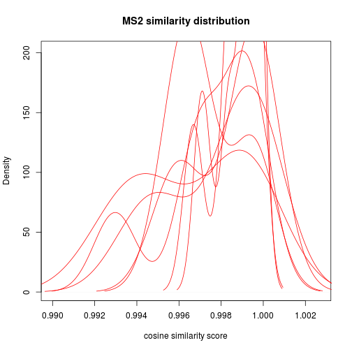

## Introduction

RFQI is a LC-MS/MS based untargeted metabolomics analysis pipeline.

## Module

1. build reference feature table

2. Mapping MS2 to reference feature table

3. Build MS2 similarity distribution

4. Idenfification

5. Quantification


### build reference feature table


```r
library(RFQI)
options(stringsAsFactors = FALSE)
```

First, we need to build a reference a feature table using a set of mzxml files.


```r
files <- dir(system.file(package="RFQI", dir="extdata"), 
              full.name=TRUE, 
              pattern="mzXML$")
param = new("ParamSet", binSize=0.25, peakwidth=c(2,30), ppm=10, noise=0, absMz=0.005, absRt=15)
```

We also need to set a reference mzXML


```r
refFile = files[1]
files = files[2]
```

Then we extract peaks from mzXML files and group them. This step is time-consuming, we can save the result for later use


```r
features = getPeakRange_multipleFiles(f.in = files, ref = refFile, param=param, cores=2)
#> [1] "beginning to get peaks from each sample"
#> [1] "beginning to group/combine peaks"
#> [1] "group 9157 peaks divided into 37 part cost 0.135991716384888 minutes"
#> [1] "group 6466 peaks divided into 1 part cost 0.703969752788544 minutes"
# save(features, ref, files, file="test_features.rData")
```

features is a list, containing two data frame. Peaks are original peaks extracted from mzXML files by centwave, group_FT are features by 
combing adjacent peaks.


```r
str(features, max.level = 1)
#> List of 2
#>  $ group_FT: chr [1:6437, 1:14] "70.509233166622" "72.0439013574296" "72.0808839267337" "74.0571356829619" ...
#>   ..- attr(*, "dimnames")=List of 2
#>  $ peaks   : num [1:9157, 1:13] 162 275 503 577 99 ...
#>   ..- attr(*, "dimnames")=List of 2
```

We have generate a features, so you can simply load it into R enviroment

```r
# data("features", package="RFQI")
```

### Mapping MS2 to a reference feature table

*After extracting features from MS1 spectrum, we need to mapping MS2 spectrum to features for annotating.*

First, we need extract MS2 spectrum from mzXML files. These files can be files used for constructing feature table, also can be other files,
as soon as they are generated in the same enviroment (e.g. same tissue type, same LC-MS/MS parameter)

getMS2FromFiles function receive mzXML files as input, and output a list. 


```r
files <- dir(system.file(package="RFQI", dir="extdata"), full.name=TRUE, pattern="mzXML$")
MS2 = getMS2FromFiles(files=files, ref_file = refFile)
str(MS2, max.level = 1)
#> List of 2
#>  $ MS2          :List of 6858
#>  $ precursorInfo:'data.frame':	6858 obs. of  6 variables:
```

Before we map MS2 to features, we can filter out some MS2


```r
mzCount = unlist(lapply(MS2$MS2, nrow)) # A qualified MS2 spectrum should have at least 3 fragments
mzMaxInt = unlist(lapply(MS2$MS2, function(x){max(x[,2])}))  # A qualified MS2 spectrum should have at least one fragment whose intensity greater than 32 (user defined)
CountFlag = !(mzCount %in% c(0,1,2))
IntFlag = mzMaxInt > 50
flag = CountFlag & IntFlag

MS2$MS2 = MS2$MS2[flag]
MS2$precursorInfo = MS2$precursorInfo[flag,]
```

We also need  set names for each MS2

```r
names(MS2$MS2) = rownames(MS2$precursorInfo) = sapply(1:nrow(MS2$precursorInfo),
convert_num_to_char, prefix = "M", n=nchar(nrow(MS2$precursorInfo)))
```

Next, we align MS2 to feature based on precursor's m/z and rt.


```r
db.MS2 = align_MS2_to_MS1(ms2Info = MS2, features = features)
```

### Build MS2 similarity distribution

* RFQI use multiple MS2 to identify one feature. First, we need to build an MS2 similarity distribution using MS2 belonging to the same feature *

Next, we calculate MS2 similarity matrix belonging to same feature
The time complexity is O(n2), where n represents the number of MS2 belonging the the same feature, we can limit the max number using maxMS2 parameter


```r
# we can calcalate similarity distribution for one feature
idx = getFeatureHasMS2(MS2DB=db.MS2, n=2)  # n is the minimum number of MS2 belonging to the same feature
distri = get_ms2Cor_inner(MS2DB = db.MS2, cores=2, maxMS2 = 100, idx=idx[1])
```


```r
plot(density(distri[[1]][,1], na.rm=TRUE), main="MS2 similarity distribution", col="red", xlab="cosine similarity score")
for (i in 2:nrow(distri[[1]])){
  lines(density(distri[[1]][,i], na.rm=TRUE), col="red")
}
```



If we do not appoint feature ID, get_ms2Cor_inner() will compute similarity matrix for all features having minimum MS2


```r
db.MS2.subset = list(MS2=db.MS2$MS2[1:500], MS2_to_MS1=db.MS2$MS2_to_MS1[1:500,]) # this line is only for test
ms2InnerCor = get_ms2Cor_inner(MS2DB = db.MS2.subset,cores = 2, n=2, maxMS2 = 100)
```

### Identification

Now, we can identify features.
Identification is based on existing standard metabolites MS2 spectrum. We have offer a standard MS2 spectrum database.


```r
data("spectrumDB", package = "RFQI")
str(spectrumDB, max.level = 1)
#> List of 2
#>  $ spectrum:List of 3
#>  $ Info    : chr [1:3, 1:5] "HMDB0000267" "HMDB0000641" "HMDB0000148" "L-Pyroglutamic acid" ...
#>   ..- attr(*, "dimnames")=List of 2
```

First, we need match features' m/z and standar metabolites m/z. As metabolites have multiple possible adduct when ionization, we need appoint the liquidChromatography column type and ESI mode (i.e, positive or negative). RFQI has offer a list of adduct corresponding to each colum-mode, so you just need to set adduct="RP_pos", etc.


